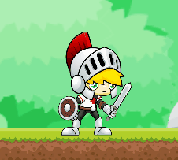

# Jogo Inglês Infantil

<h1 align ="center">
  
</h1>  

Esse projeto de Trabalho de Conclusão de Curso foi um desenvolvimento de um jogo 2D sobre o tema de inglês infantil para crianças do ensino fundamental, utilizando ferramentas como Unity e C#.

<b>Tabela de conteúdos</b>

- [Sobre](#Sobre)
- [História](#História)
- [Instalação](#Instalação)
- [Informações](#Informações)
- [Tecnologias](#Tecnologias)
- [Monografia](#Monografia)

# Sobre

Este projeto apresenta a criação de um jogo educativo denominado “<i>Jogo Inglês Infantil</i>”
com o propósito de fornecer um aplicativo para dispositivos móveis como recurso didático, para que seja utilizado no processo de ensino e aprendizagem da Língua Inglesa para crianças da educação infantil com faixa etária entre 6 e 8 anos.

A criação do jogo também visa que as crianças possam adquirir conhecimentos sobre vocabulário da Língua Inglesa fora do ambiente escolar, assim, por meio do jogo, será possível proporcionar experiências que conduzam os usuários a assimilarem melhor o conteúdo.

Nele também são empregados recursos que auxiliam no processo de aprendizado, tais como ilustrações por meio de imagens, vocabulários de palavras e sons pronunciados em inglês que ajudam as crianças a memorizar e assimilar melhor as palavras apresentadas.

# Historia

O Jogo Inglês Infantil tem como personagem principal o cavaleiro que com sua espada irá combater diversos inimigos e vencer os obstáculos encontrados no desenrolar das fases. O jogador também deverá coletar as moedas que encontrar pelo caminho para evitar que seja eliminado do jogo na hipótese de perder todas as suas vidas. Então, o jogador será desafiado a responder questões referente ao conteúdo básico da Língua Inglesa baseado em um vocabulário de palavras.

Esses desafios estarão presentes em determinados locais de cada fase e devem ser respondidos corretamente. Se respondido de modo correto, será liberado uma outra parte do cenário da fase, para que o jogador possa prosseguir sua aventura até chegar ao final da fase.

Vale destacar também que, diferente do Modo Aventura aqui descrito, existe o Modo Quiz que expõe 4 temas e nada mais é do que um jogo de perguntas e respostas, o que permite que o jogador não seja obrigado a se aventurar pelas fases.

# Instalação

O jogo está disponível no Google Play e para realizar o download do jogo “<i>Jogo Inglês Infantil</i>” na Google Play Store, pode ser procurando pelo nome do aplicativo na loja ou através do seguinte link: <a href="http://bit.ly/JogoInglesInfantil"> http://bit.ly/JogoInglesInfantil</a> ou através do QR Code:

<h3 align ="center">
  
</h3>

# Informações

Todas as informações a respeito do jogo, estão presentes através do site: <a href="https://jogoinglesinfantil.blogspot.com"> https://jogoinglesinfantil.blogspot.com</a>

Como informações de:

<ol>
    <li><a href="https://jogoinglesinfantil.blogspot.com/2021/04/privacy-policy-para-idioma-portugues.html"> Política de Privacidade</a>;</li>
    <li><a href="https://jogoinglesinfantil.blogspot.com/2021/04/faca-o-download-do-arquivo.html"> Download em aparelhos com versões antigas do Android (inferior à 7.1)</a>;</li>
    <li><a href="https://jogoinglesinfantil.blogspot.com/2021/12/termo-de-consentimento-para-uso-do.html"> Termo de consentimento para uso do áudio no jogo</a>;</li>
    <li><a href="https://jogoinglesinfantil.blogspot.com"> Notícias das novas atualizações que podem ser acompanhadas no site</a>.</li>
</ol>

# Tecnologias

As seguintes ferramentas foram usadas na construção do projeto:

- [Unity 3D](https://unity.com/)
- [C#](https://docs.microsoft.com/pt-br/dotnet/csharp/)

# Monografia

Este projeto foi apresentado ao Instituto de Ciências Exatas e Aplicadas
da Universidade Federal de Ouro Preto (UFOP) como requisito do Trabalho de Conclusão de Curso II do curso de Bacharelado em Sistemas de Informação, obtendo nota máxima para sua aprovação e a monografia realizada está presente na Biblioteca Digital de Trabalhos de Conclusão de Curso, através do seguinte link: <a href="https://jogoinglesinfantil.blogspot.com"> Desenvolvimento de uma aplicação para o ensino e aprendizagem da Língua Inglesa</a>.

Made with 💜 by Diego Henrique 👋 [See my Linkedin](https://www.linkedin.com/in/diegohts/)
